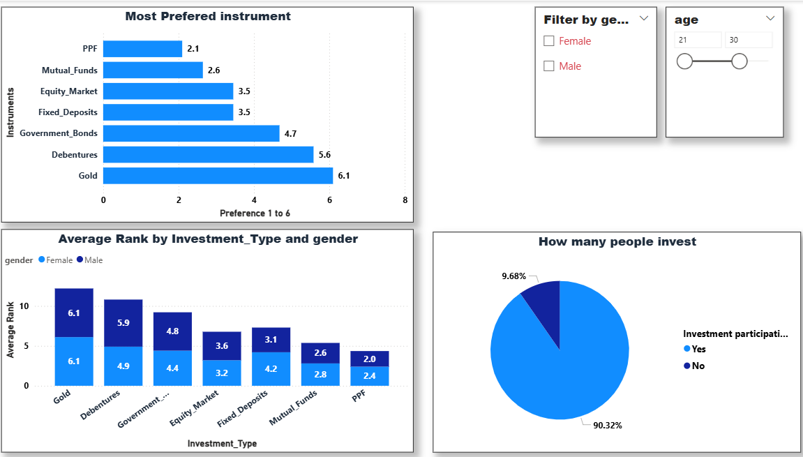

# Investment Preference Analysis (Power BI)

## 📊 Project Overview
This project analyzes investment preferences based on survey data using Power BI.

## 🎯 Objective
To identify the most preferred investment options and analyze patterns based on gender and participation.

## 📈 Key Insights
1. PPF and Mutual Funds are the most preferred investment options among respondents.
2.between age 21-25 the respondent chose Equity and mutual fund to be the most preferred .
3.As Age increases PPF, Mutual fund and Equity are most common among female and for male it is PPF, Mutual find and FD resp.
4. Gold and Debentures are the least preferred investment choices.
5. Approximately 92% of respondents are actively investing.
6. Investment preferences are broadly similar across genders, with minor variations.

## 🛠 Tools Used
- Power BI
- Power Query
- DAX

## 🛠 Dashborad preview

